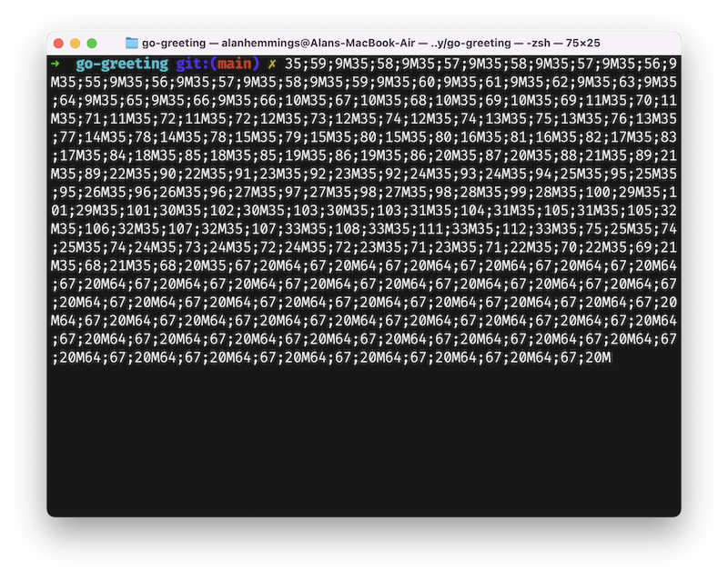

# knowledge base

List of strange issues I encountered that are not described in the package libs or books, and what I did to resolve, and-or identify. Ideally this list includes text I can find using text search.

# Corrupted console

-   If you wrote some code that uses termdash and you see the following corruption after you quite the app, or control + c ...

    

-   then the possible root causes to investigate are:

    1. Failure to properly use the control+c pattern. (todo, need to add to konsoleDSL)
    2. Not closing the terminal properly. Overriding or stopping the default built in 'q' to quit code in consoleDSL spike.
    3. Creating a new context and not re-using the supplied (returned) ctx.