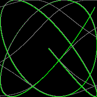

# Alan's random sandbox of snippets and references

Collection of small simple experiments in different go language topics. Note, these have not been curated or even code reviewed, it's just a random collection of stuff.

### language basics

-   structs, maps and arrays

    -   [structs and maps](pkg/structsandmaps/structsandmaps.go)
    -   [no matrixes](pkg/arrs/matrix.go)
    -   [sorting](pkg/arrs/sorting.go)
    -   [custom collections](pkg/customcollection/string-or-int-list.go)

-   channels

    -   [simple signal channels](pkg/muxyidiomatic/muxyidiomatic-signals.go)
    -   [quote stream (stream of quotes pushed to a channel)](pkg/bloggy/quotestream/quotestream.go)
    -   [signal channels together with waitgroup](pkg/muxyidiomatic/muxyidiomatic-waitgroup.go)

    -   [channels for service status](pkg/channels/channels-for-service-status.go)
    -   [magic numbers in channels](pkg/channels/magic-number-channel.go)

-   waitgroup

    -   [test waitgroup](pkg/testwaitgroup/testwaitgroup.go)

-   switch

    -   [fizz buzz switch example](pkg/switchy/switchy.go)

-   timing

    -   [timing example](pkg/timing/timing.go)

-   json

    -   [anon structs and json](pkg/learninggo/anonstructsandjson.go)

-   graphics

    -   [Lissajous animated gif generator (from Learning Go book)](pkg/learninggo/lissajous.go)

        

-   error handling

    -   [typical error handling](pkg/errorhandling/errorhandling.go)
    -   [custom error objects](pkg/errorhandling/custom-errors.go)

-   dependency injection

    -   [http server example from 'learning Go'](pkg/dependencyinjection/main.go)

### important reference examples

Semi curated list of spike code that I suspect I will need quick access to.

-   console services

    -   [handling control-c properly](pkg/controlc/controlc.go)

### switching from C#

-   goroutines (threading and async)

    -   [async spike, download files and similar to Task.WaitAll](pkg/bloggy/spikeasync.go)

-   linq

    -   [no linq](pkg/nolinq/nolinq.go)

        ```go
            // querying objects in a similar to linq style, in go.
            var cars = []car{
                {1950, "Jay Leno", "buic", "red", 1},
                {1965, "Jay Leno", "chrysler", "blue", 2},
                {2000, "Fred", "bmw", "black", 3},
                {2010, "Dan", "volvo", "red", 4},
            }

            var g = garage(cars)

            fmt.Println("\nVintage\n", g.vintage())
            fmt.Println("\nRed\n", g.color("red"))
            fmt.Println("\nVintage AND red\n", g.vintage().color("red"))
            fmt.Println("\nVintage OR red\n", g.vintage().or(g.color("red")))
        ```

        produces

        ```log

        Vintage
        [{1950 Jay Leno buic red 1} {1965 Jay Leno chrysler blue 2}]

        Red
        [{1950 Jay Leno buic red 1} {2010 Dan volvo red 4}]

        Vintage AND red
        [{1950 Jay Leno buic red 1}]

        Vintage OR red
        [{1950 Jay Leno buic red 1} {1965 Jay Leno chrysler blue 2} {2010 Dan volvo red 4}]

        ```

-   software patterns

    -   [decorator, 3 lines](pkg/decorator/decorator_test.go)

        -   [same code in C# jsfiddle](https://dotnetfiddle.net/9bRx4e)

            ```go
                type DecoratedAdd func(a int, b int) int

                // this is such a quick way to implement a decorator
                func (f DecoratedAdd) Add(a int, b int) int {
                    fmt.Println("before")
                    defer fmt.Println("after")
                    r := f(a, b)
                    fmt.Println("result", r)
                    return r
                }

                func Test_howToUseDecorator(t *testing.T) {
                    ad := DecoratedAdd(AddNums)
                    r := ad.Add(1, 3)
                    if r != 4 {
                        t.Error("expected 4")
                    }
                }

                func AddNums(a int, b int) int {
                    return a + b
                }
            ```

    -   [circuit breaker example from 'cloud native go'](pkg/bloggy/breaker/breaker.go)
    -   [sample quote api using rate limiter return 429 if requests too fast](pkg/bloggy/quoteapi/quoteapi.go)

### experimental

Random spike projects, to test to see what it might take to write something yourself, without using a recommended package.

-   currency, money and hand rolled decimal-like types

    -   [test account service](pkg/testaccoiuntservice/testaccountservice.go)
    -   [money gpb, usd, zar](pkg/money/money.go)
