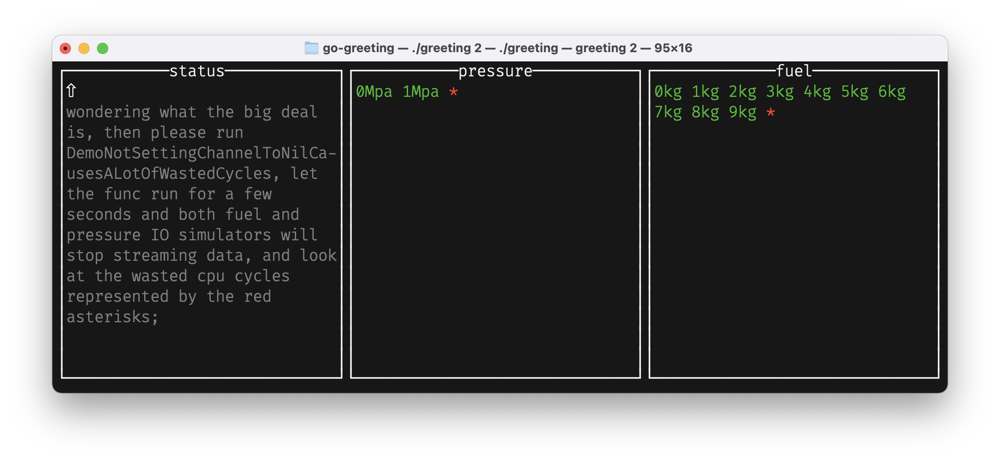
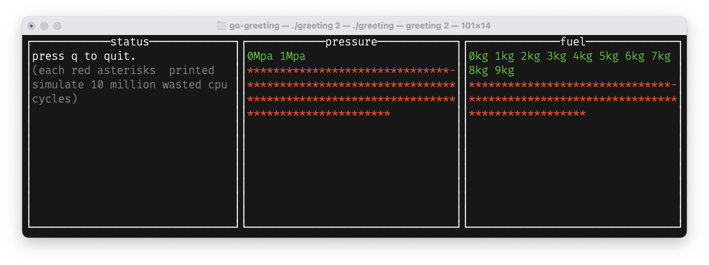
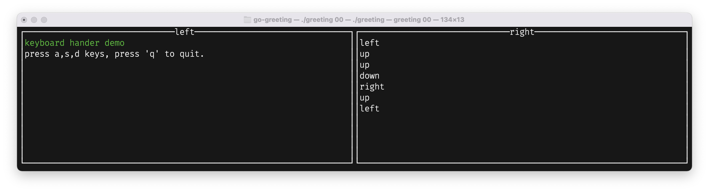
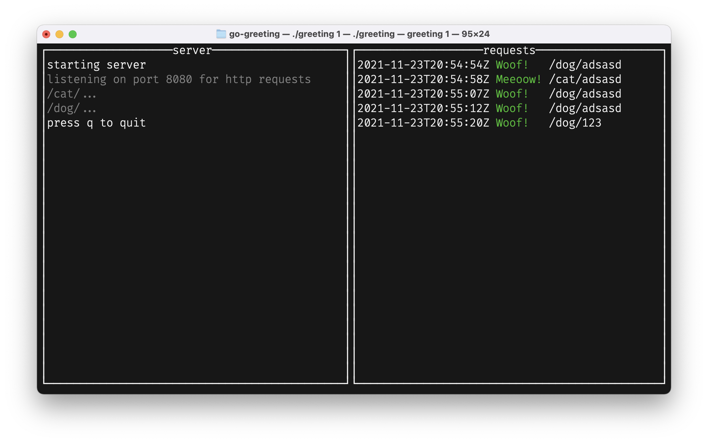
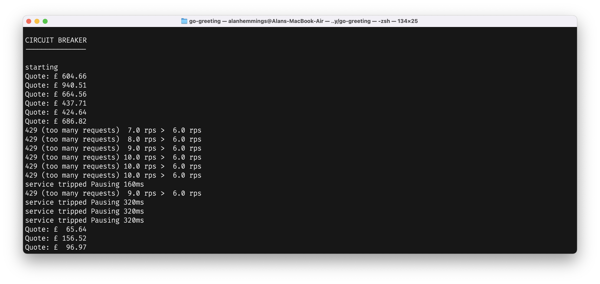
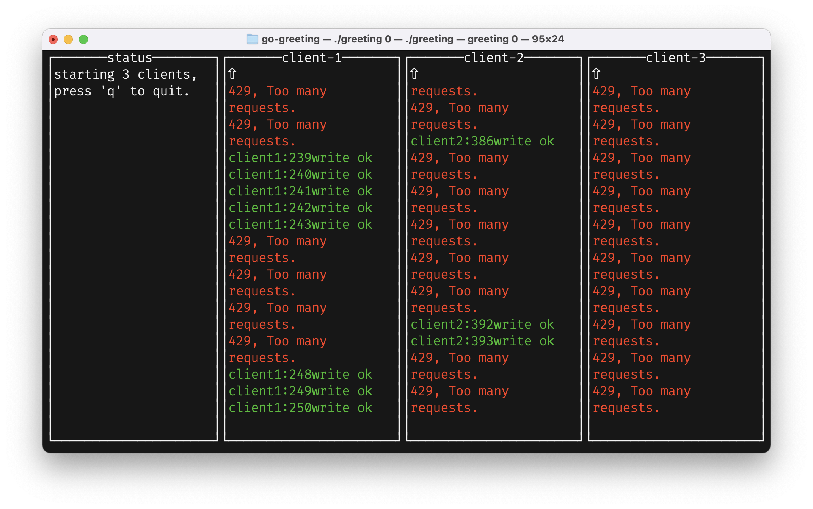

# Alan's random sandbox of snippets and references

Collection of small simple experiments in different go language topics. Note, these have not been curated or even code reviewed, it's just a random collection of stuff.

Please take any code samples here with a huge pinch of salt. I'm writing these as I learn go, so early spikes will be very naieve, and later ones will hopefully start to show some discipline. This code does not represent code I would write in production, and is just a sandbox to play with. 

-   Best links : start here

    -   ↪ [Golang concurrency patterns (talks.golang.org)](https://talks.golang.org/2012/concurrency.slide) 

-   Books & online resources
    -   books
        -   ↪ [Learning Go](https://www.oreilly.com/library/view/learning-go/9781492077206/) _Jon Bodner_
        -   ↪ [Cloud Native Go](https://www.oreilly.com/library/view/cloud-native-go/9781492076322/) _Matthew A. Timus_
        -   ↪ [The Go Programming Language](https://www.pearson.com/us/higher-education/program/Donovan-Go-Programming-Language-The/PGM234922.html) _Alan A.A. Donovan, Brian W. Kerninghan_
        -   ↪ [Concurrency in Go](https://www.oreilly.com/library/view/concurrency-in-go/9781491941294/) _Katherine Cox-Buday_
    -   websites
        -   ↪ https://golangbyexample.com/

# shortcuts to spikes

-   basic types, enums, datetime

    -   [example of consts enums and iota](pkg/erroraddress/erroraddress.go)
    -   [time.Time](pkg/datetime/datetime_test.go)

-   structs, maps and arrays

    -   [structs and maps](pkg/structsandmaps/structsandmaps2.go)
    -   [no matrixes](pkg/arrs/matrix.go)
    -   [sorting](pkg/arrs/sorting.go)
    -   [custom collections](pkg/customcollection/stringorintlist.go)

-   formatting

    - [time formatting, example using RFC3339 - `2012-11-23T20:08:41Z`](pkg/nethttp2/spikeserver.go)

-   file IO

    -   [read write text files](pkg/fileio/textio/rwbinaryfiles.go)
    -   [read write binary files](pkg/fileio/byteio/rwtextfiles.go)
    -   [reading zip file](pkg/fileio/gzips/reading_test.go)

-   json marshalling

    -   [anon structs and json](pkg/learninggo/anonstructsandjson.go)
    -   [marshalling and unmarshalling (serialising and deserialising)](pkg/marshalling/marshalling_test.go)

-   channels and concurrency

    -   [buffered channels example showing concurrently calling microservice and returning results via a buffered channel](pkg/channels/bufferedchannels.go)
    -   [channels can be constrained as read-only or write-only](pkg/concurrencypatterns/directionalchannels.go)
    -   [use cancel function instead of signal channel to cancel long running goroutines](pkg/concurrencypatterns/cancelfunction.go)
    -   [demo showing how deadlock can occur](pkg/concurrencypatterns/sampledeadlock.go)
    -   [for select loop pattern](pkg/concurrencypatterns/forselectloop.go)
    -   [simple signal channels](pkg/muxyidiomatic/muxyidiomaticsignals.go)
    -   [quote stream (stream of quotes pushed to a channel)](pkg/bloggy/quotestream/quotestream.go)
    -   [signal channels together with waitgroup](pkg/muxyidiomatic/muxyidiomaticwaitgroup.go)
    -   [channels for service status](pkg/channels/servicestatuschannels.go)
    -   [magic numbers in channels](pkg/channels/magicnumberchannel.go)
    -   [setchanneltonil.go](pkg/channels/setchanneltonil.go) : *setting a channel to nil to turn off a `finished` channel of and avoid wasting cpu cycles*
    
    -   [setchanneltonil.go](pkg/channels/setchanneltonil.go) : *NOT setting a channel to nil to turn off a `finished` channel to avoid wasting cpu cycles*
    

-   waitgroup

    -   [test waitgroup](pkg/testwaitgroup/testwaitgroup.go)

-   switch

    -   [fizz buzz switch example](pkg/switchy/switchy.go)

-   timing

    -   [timing example](pkg/timing/timing.go)

-   context

    -   [context with cancel example](pkg/spikequotes/bloggy.go)

-   graphics

    -   [Lissajous animated gif generator (from Learning Go book)](pkg/learninggo/lissajous.go)

-   error handling

    -   [typical error handling](pkg/errorhandling/errorhandling.go)
    -   [custom error objects (dont do this)](pkg/errorhandling/customerrorswrong.go)
    -   [wrapping errors](pkg/errorhandling/wrappingerrors.go)
    -   [wrapping errors with defer](pkg/errorhandling/wrappingerrorwithdefer.go)
    -   external links
        -   [routing](https://www.honeybadger.io/blog/go-web-services/)

-   dependency injection

    -   [http server example from 'learning Go'](pkg/dependencyinjection/main.go)

-   console services

    -   [handling control-c properly](pkg/controlc/controlc.go)
    -   [termdash spike (simple window split left, right)](pkg/consolespikes/spiketermdash.go)
    -   [usingkeyboardhandlers.go](pkg/consolespikes/usingkeyboardhandlers.go) *simple demo showing how to use my Konsole wrapper around termdash to create a UI + wiring up key event handlers*
    

-   goroutines (threading and async)

    -   [async spike, download files and similar to Task.WaitAll](pkg/bloggy/spikeasync.go)
    -   [BlockingCollection vs channels](pkg/concurrencypatterns/blockingcollectionvschannels.md)

-   net/http
    - ref ↪ [routing](https://www.honeybadger.io/blog/go-web-services/)
    -   [http REST calls to json api with json marshalling](pkg/nethttp/nethttp_test.go)
    -   [spikeserver.go](pkg/nethttp2/spikeserver.go) : *minimal http 2.0 server*
    
    

-   nolinq

    -   [no linq](pkg/nolinq/nolinq.go)

-   pseudo linq

    -   [suffix](pkg/pseudolinq/suffix.go)

-   Software patterns

    -   [decorator : 3 lines](pkg/decorator/decorator_test.go)
    -   [spikequotes.go](pkg/bloggy/breaker/breaker.go) : *DemoCallingAPIsWithCircuitBreaker starts a test quotestream that uses a circuit breaker and `paulbellamy/ratecounter` to limit requests per second*
        -  : 
-   Patterns - backpressure
    -   [quotes and extracts](pkg/backpressuredemo/readme.md)
    -   [quoteapi.go](pkg/bloggy/quoteapi/quoteapi.go) : *sample quote api using rate limiter return 429 if requests too fast*
    -   [concurrencylimiterdemo.go](pkg/backpressure/concurrencylimiterdemo.go) : *simple concurrency limiter demo*
        - 

-   Random spikes

    -   [test account service](pkg/testaccountservice/testaccountservice.go)
    -   [money gpb, usd, zar](pkg/money/money.go)

    random text, test pushing commit from new machine.

-   Configuring goland first install

    ```ruby
    # paths, imports, lint, shadow, add to zshrc
    # ----------------------------
    export GOPATH=$HOME/src/go-workspace
    export PATH=$GOPATH/bin:$GOROOT/bin:$PATH

    # run once after go is installed to install go tooling
    # ----------------------------------------------------
    go install golang.org/x/tools/cmd/goimports@latest
    go install golang.org/x/lint/golint@latest 
    go install golang.org/x/tools/go/analysis/passes/shadow/cmd/shadow@latest

    # vscode editor settings
    # ----------------------
    indenting : workbench, tree indent. set this to max `40` depending on screen.
    ```

-   ~/.zshrc settings

Use aliases to create shortcuts to jump to folders.

    ```ruby
        alias greet='cd src/go/go-workspace/src/github.com/goblinfactory/go-greet'
    ```

-   osx hints, first time users

    - to edit zsh config `vi ~/.zshrc`
    - [beginners guide to vi](https://www.redhat.com/sysadmin/introduction-vi-editor)

-   [Random problems and solutions (knowledge base)](knowledge-base.md)